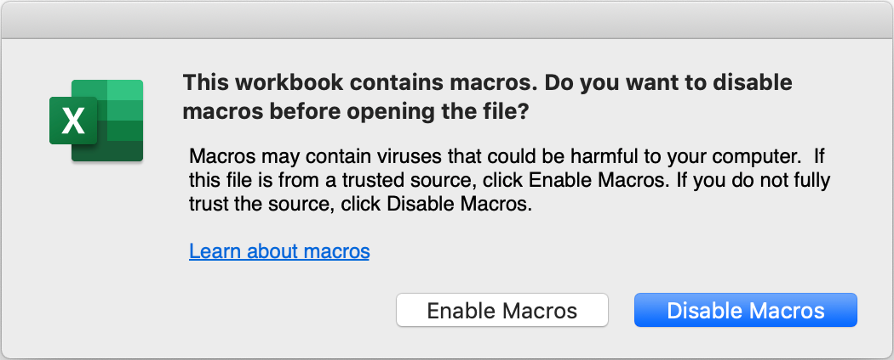
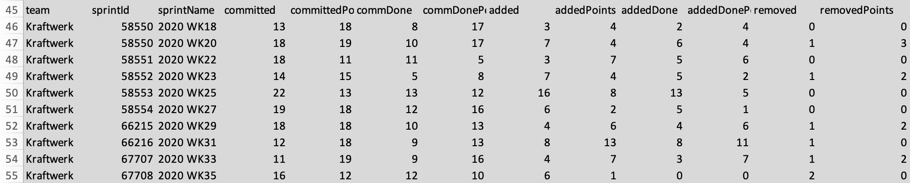
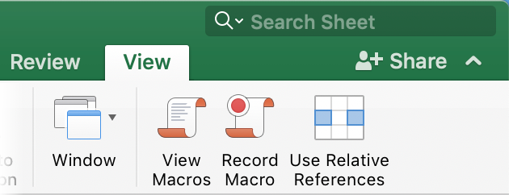
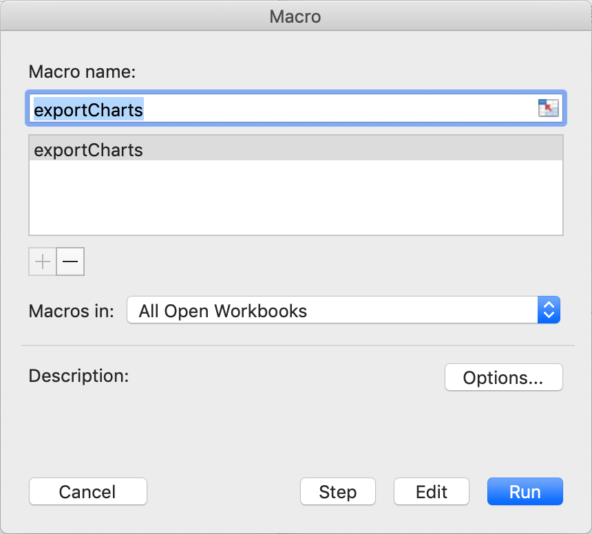
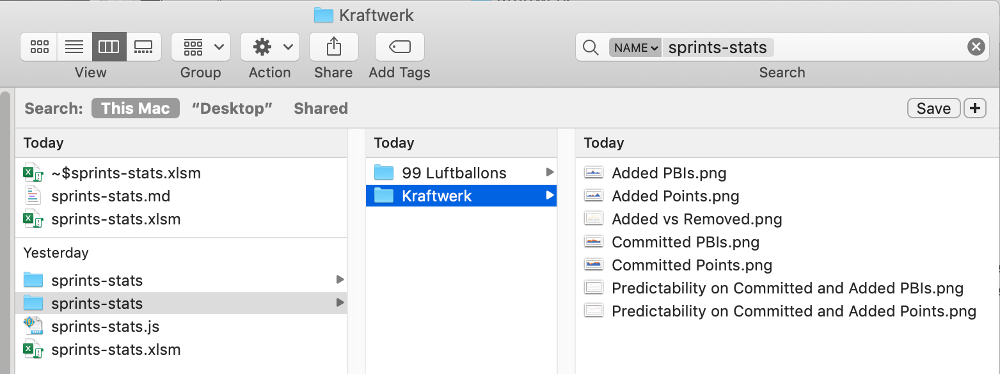

# Sprints Statistics

## Pre-requisite
So far, tested on [Atlassian Jira](https://www.atlassian.com/software/jira) v8.5.1, might work on other versions... or not :).
The Excel sheet has been tested on Mac OS/Microsoft Office 2019 only (I struggled a bit to make it working actually). Hoping it works smoothly on Windows.

## Purpose
### Purpose of this script
Report on the predictability of a team. It's based on PBIs and points so it should fit your practice.
Gives predictability on points and items. Gives the added and removed items of the sprints.


### Purpose from a SM Point of view
Help our teams to be engaged/aligned with the enterprise goals and sprint commitments.

### Purpose from a PO/Stakeholder Point of view
The product owner will have a fair ETA of completion.
Let's assume an Epic is 50 story points, the team velocity is 15 points per sprint, and the predictability of the team is 75% (which is very good already).
Should be 5 sprints to complete with the current velocity/effort and workload (`50/15/0.75=4.44 sprints`). 

## Install
```bash
# install the dependencies with npm
$ npm install
```

## A spice of configuration

### `config.js`
Copy `classes/config-dist.js` and renamed it to `classes/config.js`
Replace the values with your credentials and Jira domain name.

```javascript
const Config = {
    USER: '##USER##',
    PASSWORD: '##PASSWORD##',
    DOMAIN_NAME: 'https://##your-jira-server##',
    BASE_URL_REST_V2: '/jira/rest/api/2/',
    
    // .......
}
```

### `sprints-stats.js`
Optionally, you can process some dedicated teams, update the constant `teams` accordingly:

```javascript
/* ###### Put the teams you want to compute or keep it blank to do them all ###### */
const teams = [ ];
// const teams = [ 'Kraftwerk' ];
/* ###### End of teams section ###### */
```

## Run
```bash
$ node sprints-stats.js 
Discarding team 99 Luftballons

team,sprintId,sprintName,committed,committedPoints,commDone,commDonePoints,added,addedPoints,addedDone,addedDonePoints,removed,removedPoints
Kraftwerk,58550,2020 WK20,18,19,10,17,7,4,6,4,1,3
Kraftwerk,58551,2020 WK22,18,11,11,5,3,7,5,6,0,0
Kraftwerk,58552,2020 WK23,14,15,5,8,7,4,5,2,1,2
Kraftwerk,58553,2020 WK25,22,13,13,12,16,8,13,5,0,0
Kraftwerk,58554,2020 WK27,19,18,12,16,6,2,5,1,0,0
Kraftwerk,66215,2020 WK29,18,18,10,13,4,6,4,6,1,2
Kraftwerk,66216,2020 WK31,12,18,9,13,8,13,8,11,1,0
Kraftwerk,67707,2020 WK33,11,19,9,16,4,7,3,7,1,2
Kraftwerk,67708,2020 WK35,16,12,12,10,6,1,0,0,2,0
Kraftwerk,67709,2020 WK37,20,6,17,3,5,1,3,0,3,0
```

## Transform the CSV formatted data
I copy paste the result to text editor. Replace the commas `,` to a tabulation `\t`.
This eases the copy/paste into the Excel sheet.

## Copy to the Excel sheet
Open the [sprints-stats](assets/sprints-stats.xlsm).

1. Enable the Macros when prompted:

2. Spot the data range:

3. Paste the data.
I use the "Paste values" to prevent any troubles with references (you have supposedly replaced the commas `,` to a tabulation `\t`).
:information_source: When I have 10 sprints already, I "roll up the 9 sprints" and add the new one at the last position.
4. Execute the macro, click on `Views/View Macros`:
,
Then click on `Run`:
,
5. Locate the charts:
On a finder (Mac), look for `sprints-stats` name, you'll see a folder named as you team.
The charts are included:
.
6. Confluence tip:
I put the 2 `predictability` charts and `add vs removed` chart to my Sprint Review confluence page.
Sprint after sprint, I clone the page. The beauty to update the charts is to simply drag and drop them into the page (in view mode, not when editing it).

## Notes on the Excel Sheet
- :warning: Tested on Mac only / Mac Office 2019
- You should rename the sheet with your own team name
- If you have multiple teams, you can either use one sheet per team or duplicate the file.\
I personally prefer the latter option so I upload the file on confluence on the team's space. 
- I only keep the last 10 sprints. I don't think it's relevant to see the trend on more than 20 weeks.
If your sprints are 1 week long, you might want to see more sprints.
- :information_source: Executing the macro on a retina screen increases the chart size!