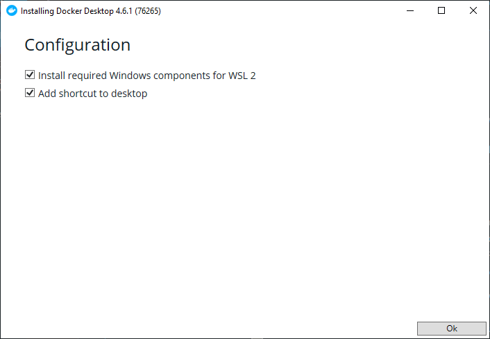
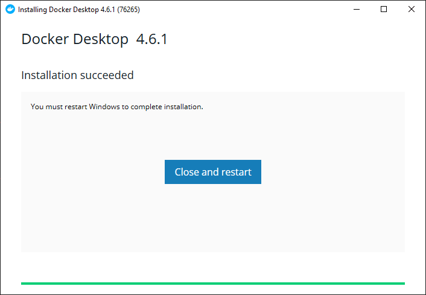
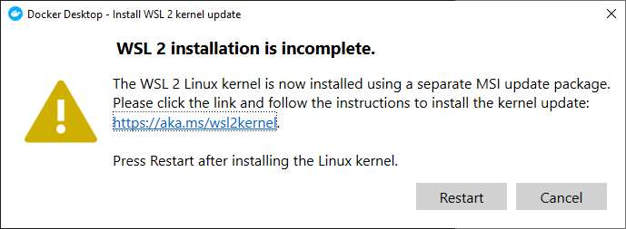
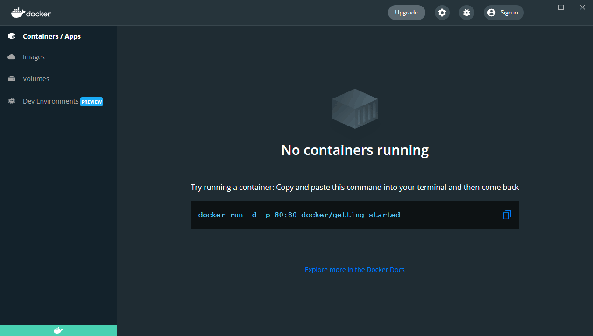
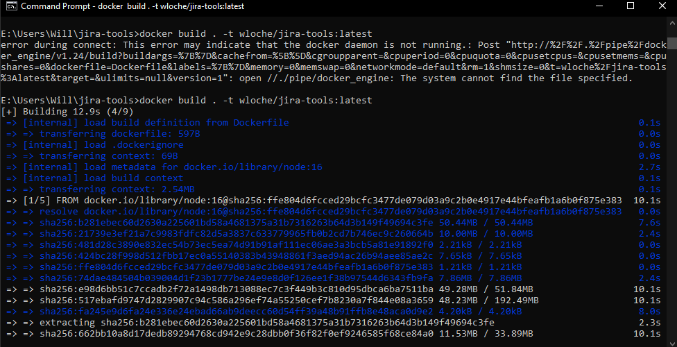
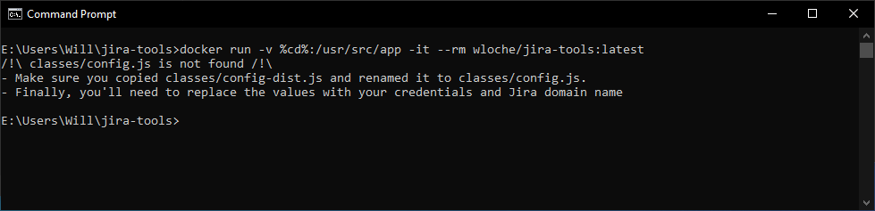

# Git
🔗 [Git: Download for Windows](https://git-scm.com/download/win)
- Use the `64-bit Git for Windows Setup` and keep all options as default unless you know.

## Clone the repo
- Open an explorer window, right click on the folder you'd like to clone the `jira-tools` repo:
  
- Choose the `Clone Existing Repository` option, then 
  
  - Source Location is: https://github.com/wloche/jira-tools.git
  - Target Directory: must be a new folder, using `/` seperator (Unix style, not Widows)
- Check the repo is cloned in your explorer:
  

# Docker
🔗 [Install Docker Desktop on Windows](https://docs.docker.com/desktop/windows/install/)
- Click on the button `Docker Desktop for Windows`:
  
- Installation complete: restart:
  
- WSL 2 installation: follow-up: follow the link and install the WSL2 Kernel:
  
- Make sure docker is running (lower left is green):
  
 
## Create the image
- Open a `Command Prompt` and navigate to your base repo, f.e. `cd "E:\Users\Will\jira-tools"`, then run `docker build . -t wloche/jira-tools:latest`:
  

## Run the container
- Still on the same `Command Prompt`, run `docker run -v %cd%:/usr/src/app -it --rm wloche/jira-tools:latest`, this error is expected:
  
- Follow the steps [A spice of configuration](sprints-stats.md#a-spice-of-configuration)
