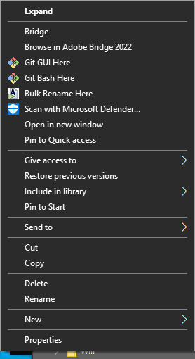
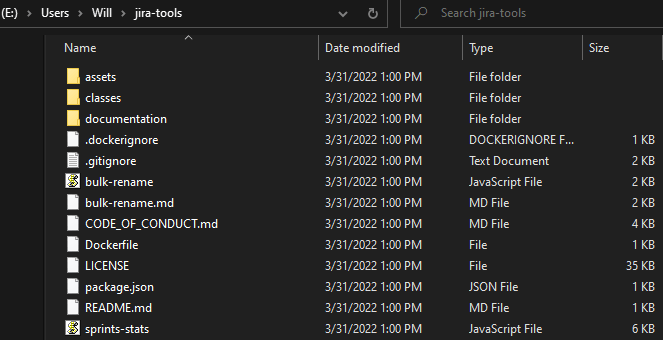

# Git
🔗 [Git: Download for Windows](https://git-scm.com/download/win)
- Use the `64-bit Git for Windows Setup` and keep all options as default unless you know.

## Clone the repo
- Open an explorer window, right click on the folder you'd like to clone the `jira-tools` repo:
  
- Choose the `Clone Existing Repository` option, then 
  
  - Source Location is: https://github.com/wloche/jira-tools.git
  - Target Directory: must be a new folder, using `/` seperator (Unix style, not Widows)
- Check the repo is cloned in your explorer:
  
